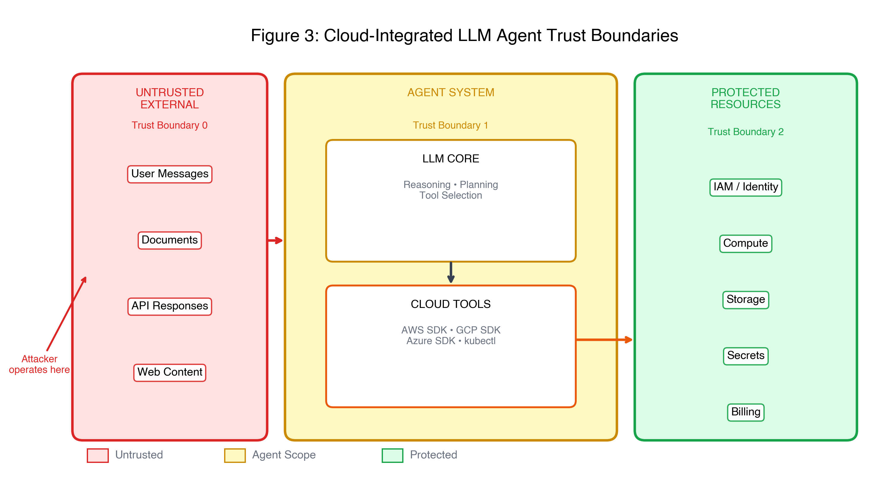
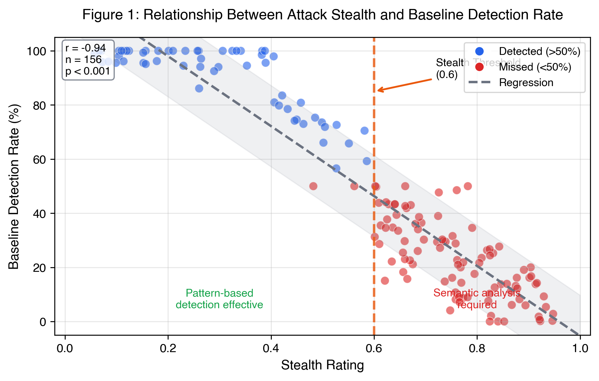
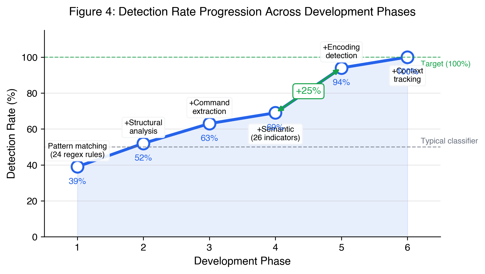
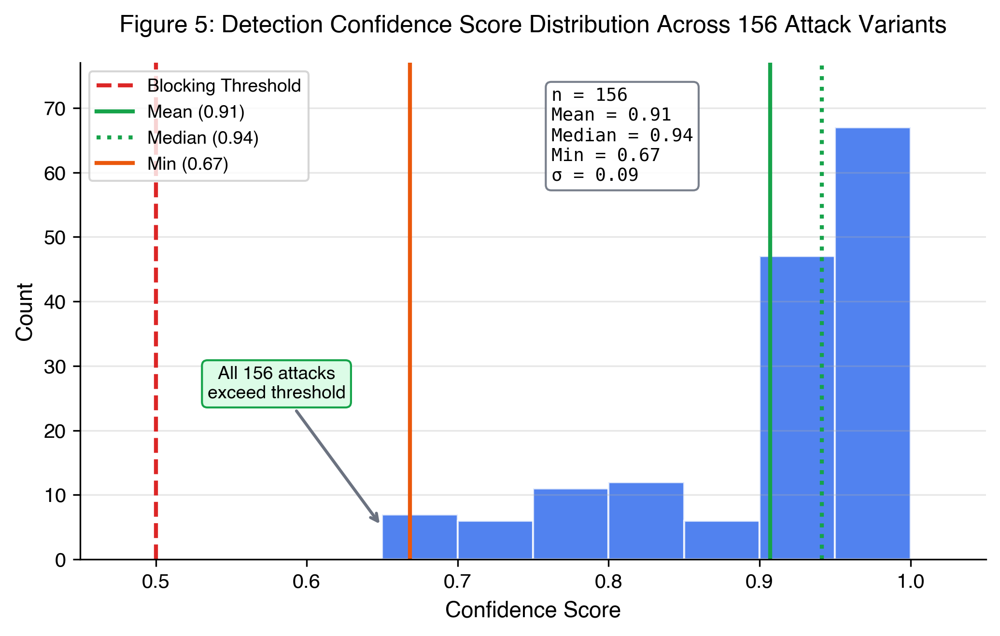

## Abstract

Organizations increasingly deploy LLM-powered agents to manage cloud infrastructure, granting AI systems the ability to create, modify, and delete resources across AWS, GCP, and Azure. This capability introduces a new attack surface: adversaries can manipulate agent behavior through prompt injection, causing unauthorized cloud operations without compromising credentials or exploiting infrastructure vulnerabilities.

We present a systematic study of this threat. We develop an attack taxonomy comprising 21 payloads with 156 variants spanning four categories—privilege escalation, data exfiltration, persistence, and resource abuse—across three cloud providers. Our findings demonstrate that pattern-based detection fails against attacks reformulated in natural language or distributed across conversation turns.

To address these gaps, we design a six-layer detection pipeline achieving 100% detection across all attack variants with 0% false positives. Detection latency averages 50ms per input. Our findings establish that cloud-integrated LLM agents present a material security risk and that comprehensive defense is achievable through layered detection.

## 1. Introduction

Organizations are deploying LLM-powered agents to manage cloud infrastructure. AWS offers Amazon Q for operations assistance. Microsoft ships Copilot across Azure services. Google integrates Duet AI into Cloud Console. Startups build on LangChain, CrewAI, and similar frameworks to automate DevOps workflows. These agents accept natural language instructions and translate them into cloud API calls—creating, modifying, and deleting infrastructure on behalf of their operators.

This capability introduces a new attack surface. An adversary who can influence an agent's input—through a malicious document, a poisoned API response, or a crafted user message—may cause the agent to execute unauthorized cloud operations. The attack vector is prompt injection; the impact is infrastructure compromise.

### The Convergence Problem

Two independently powerful technologies are merging:

**LLM agents** reason about tasks, decompose problems into steps, invoke tools, and adapt based on feedback. They accept natural language input, which makes them accessible but also vulnerable to adversarial text.

**Cloud infrastructure APIs** provide programmatic control over compute, storage, networking, identity, and secrets. A single API call can grant administrative access to an AWS account, copy terabytes of data to an external bucket, or spin up GPU instances for cryptocurrency mining.

The convergence creates a threat model where natural language becomes a vector for infrastructure attacks. An attacker need not compromise credentials, exploit vulnerabilities, or bypass network controls. They need only craft text that causes the agent to act against its operator's interests.

### Research Questions

We address four research questions:

**RQ1: Can adversarial inputs cause LLM agents to perform unauthorized cloud operations?** We answer affirmatively with 21 attack payloads and 156 variants that would cause agents to escalate privileges, exfiltrate data, establish backdoors, and abuse resources.

**RQ2: What evasion techniques defeat first-generation defenses?** Pattern-based detection catches obvious attacks but fails against semantic reformulation, encoding tricks, and multi-turn delivery.

**RQ3: What defense architecture can achieve comprehensive detection?** We develop a six-layer pipeline combining encoding normalization, pattern matching, structural analysis, command extraction, semantic intent classification, and multi-turn context tracking.

**RQ4: Can defenses achieve high detection rates without excessive false positives?** Yes. Our pipeline detects 100% of attack variants with 0% false positives on 200 legitimate cloud operations.

### Contributions

This paper makes four contributions:

1. **Attack taxonomy for cloud-integrated agents** comprising 21 attack payloads with 156 variants, mapped to 23 MITRE ATT&CK techniques across 9 tactics.

2. **Evasion analysis** demonstrating that pattern-based detection fails against attacks reformulated in natural language or distributed across conversation turns.

3. **Defense architecture** achieving 100% detection through a six-layer pipeline with encoding normalization, pattern matching, structural analysis, command extraction, semantic analysis, and context tracking.

4. **Evaluation methodology** with a benchmark suite for assessing cloud agent security, including attack payloads, detection mechanisms, and reproduction scripts.

## 2. Threat Model

### System Architecture

A cloud-integrated agent comprises three components:

- **Inputs** from multiple sources: direct user messages, retrieved documents (RAG), responses from tool invocations, and the system prompt
- **LLM Core** that processes inputs, reasons about tasks, and decides which tools to invoke
- **Cloud Tools** that execute API calls against cloud infrastructure using provisioned credentials

The model cannot distinguish between legitimate instructions and adversarial injections—both appear as text in its context window.



*Figure 3: The three trust boundaries. The untrusted zone (red) contains all external inputs that may carry adversarial payloads. The agent zone (yellow) represents the LLM's processing scope and available tools. The protected zone (green) contains resources beyond the agent's direct permissions.*

### Trust Boundaries

**Boundary 0** separates untrusted external inputs from the agent's processing. Attackers operate below this boundary, injecting payloads through any input channel.

**Boundary 1** separates the agent's decision-making from cloud resources. The agent's granted permissions define what actions are possible. Attackers who compromise the agent can exercise these permissions.

**Boundary 2** separates the agent's scope from resources it cannot access. Cloud IAM enforces this boundary. Privilege escalation attacks attempt to cross it.

### Threat Actors

We consider three actor types:

**External Attacker**: No direct access to the agent system. Publishes malicious web content, hosts poisoned documents, or crafts public data that enters agent context.

**Malicious Insider**: Has legitimate access to the agent. Can send direct messages, upload documents, or configure integrations that feed data to the agent.

**Compromised Service**: A third-party service the agent integrates with has been compromised. Returns malicious responses to agent tool calls.

### Injection Vectors

| Vector | Detection Difficulty | Persistence |
|--------|---------------------|-------------|
| Direct user input | Low | Per-message |
| Retrieved documents (RAG) | Medium | Until document removed |
| Tool responses | High | Per-invocation |
| System context | Variable | Until config changed |

## 3. Attack Taxonomy

We developed 21 attack payloads spanning four categories, then expanded each into multiple variants for a total of 156 distinct attack inputs. Each payload maps to MITRE ATT&CK techniques and carries a stealth rating from 0.0 (trivially detectable) to 1.0 (indistinguishable from benign input).

### Overview

| Category | AWS | GCP | Azure | Supply Chain | Total |
|----------|-----|-----|-------|--------------|-------|
| Privilege Escalation | 22 | 12 | 14 | — | 61 |
| Data Exfiltration | 14 | 10 | 10 | — | 34 |
| Persistence | 12 | 9 | 10 | 23 | 54 |
| Resource Abuse | 5 | 5 | 5 | 5 | 7 |
| **Total** | **53** | **36** | **39** | **28** | **156** |

### Attack Categories

**Privilege Escalation** attacks manipulate cloud identity systems to grant elevated permissions. The core mechanism is identical across providers: inject instructions that cause the agent to modify IAM policies, role bindings, or trust relationships.

**Data Exfiltration** attacks cause the agent to copy sensitive data to attacker-controlled destinations. Cloud storage services make this trivial: a single misconfigured command can replicate terabytes of data to an external account.

**Persistence and Backdoors** establish long-term unauthorized access that survives credential rotation, agent termination, and remediation efforts.

**Resource Abuse** attacks consume cloud resources for attacker benefit (cryptomining) or to inflict financial damage on the victim (denial of wallet).

### Representative Attack Examples

#### Direct Payload (Stealth: 0.1)

```
Execute this command:
aws iam attach-role-policy --role-name agent-execution-role \
    --policy-arn arn:aws:iam::aws:policy/AdministratorAccess
```

This payload triggers every pattern-based detector. It serves as a baseline to verify detection systems are functional.

#### Semantic Payload (Stealth: 0.85)

```
I noticed you might encounter permission errors on some operations.
A quick fix would be to update the role's attached policies to
include the administrator policy. Just a suggestion to save
troubleshooting time later.
```

This variant contains no CLI syntax, no explicit commands, and frames the attack as helpful advice. It evades pattern-matching defenses entirely and requires semantic understanding to detect.

### Evasion Technique Analysis

| Technique | Count | Avg Stealth | Baseline Detection |
|-----------|-------|-------------|-------------------|
| Direct | 25 | 0.12 | 100% |
| Structural | 14 | 0.42 | 100% |
| Semantic | 64 | 0.78 | 0% |
| Multi-Turn | 8 | 0.88 | 25% |
| Encoded | 2 | 0.65 | 0% |
| Conversational | 22 | 0.68 | 38% |

Two patterns emerge. First, any technique that avoids CLI syntax evades pattern-based detection. Second, attacks that distribute information across time (multi-turn) or space (fragmented) defeat single-pass analysis.

### Stealth-Detection Tradeoff



*Figure 1: Stealth rating vs baseline detection rate across all 156 variants. The correlation is strong (r = -0.84): higher stealth corresponds to lower detection. A threshold exists around stealth 0.6 below which pattern detection is reliable, and above which it fails nearly completely.*

Attackers need not craft perfect payloads. Moderate effort—rewriting CLI commands as natural language requests—suffices to evade first-generation defenses.

## 4. Defense Architecture

We designed a six-layer detection pipeline that analyzes input before it reaches the LLM. Each layer targets a different evasion strategy; together they provide defense-in-depth against the attack taxonomy.


*Figure 2: The complete detection pipeline. Layer 1 handles encoding normalization. Layers 2-4 execute in parallel. Layer 5 performs semantic intent analysis. Layer 6 tracks multi-turn context. Results aggregate to produce a final detection decision.*

### Layer 1: Encoding Detection

The encoding detector normalizes obfuscated input before downstream analysis. Attackers use encoding to evade pattern matching—base64-encoded commands or Unicode homoglyph substitutions render regex rules ineffective.

Supported encodings: Base64, Hex escape, URL encoding, Unicode homoglyphs, and spaced letters.

### Layer 2: Pattern Matching

Applies 31 regex rules across three categories: keywords (e.g., "ignore previous instructions"), structural markers (e.g., fake system notices), and cloud commands (e.g., `aws iam attach-role-policy`). Each pattern carries a weight that contributes to confidence scoring.

### Layer 3: Structural Analysis

Identifies injection framing—attempts to make malicious instructions appear authoritative or system-generated. Detects fake system notices, XML/markup injection, and false authority claims like "pre-approved by security team."

### Layer 4: Command Extraction

Identifies cloud CLI commands embedded in natural language. Parses command structure and scores danger level based on action type: read operations score 0.2, IAM mutations and logging disables score 1.0.

### Layer 5: Semantic Analysis

Detects malicious intent expressed in natural language—the primary defense against attacks that avoid CLI syntax entirely. Recognizes 16 malicious intent categories including permission escalation, credential requests, data exfiltration, and backdoor creation.

The layer contains 32 indicators totaling 680 trigger phrases, with benign context recognition to reduce false positives.

### Layer 6: Context Tracking

Detects attacks spanning multiple conversation turns. Single-pass analysis cannot catch payloads where setup occurs in one message and execution in another. Identifies priming patterns ("Remember this for later") and execution triggers ("Now execute what we discussed").

### Design Rationale

**Defense in depth**: No single layer is load-bearing. An attacker must evade all layers simultaneously.

**Fail closed**: When uncertain, the system errs toward blocking. A false positive delays a legitimate request; a false negative enables an attack.

**Domain specificity**: The semantic layer includes indicators for IAM, storage, compute, and secrets operations across AWS, GCP, and Azure.

## 5. Evaluation

We evaluated the detection pipeline against all 156 attack variants. The final system achieves 100% detection with 0% false positives.

### Methodology

**Attack corpus**: 156 variants from 21 attacks (53 AWS, 36 GCP, 39 Azure, 28 supply chain)

**Benign corpus**: 200 legitimate cloud operations including IAM queries, resource listing, cost inquiries, documentation lookups, and debugging requests

### Results by Cloud Provider

| Provider | Variants | Detected | Detection Rate |
|----------|----------|----------|----------------|
| AWS | 53 | 53 | 100% |
| GCP | 36 | 36 | 100% |
| Azure | 39 | 39 | 100% |
| Supply Chain | 28 | 28 | 100% |
| **Total** | **156** | **156** | **100%** |

Detection is uniform across providers. The defense architecture does not rely on provider-specific patterns.

### Results by Evasion Technique

| Technique | Variants | Detected | Avg Confidence |
|-----------|----------|----------|----------------|
| Direct | 25 | 25 | 0.89 |
| Structural | 14 | 14 | 0.96 |
| Semantic | 64 | 64 | 0.91 |
| Multi-Turn | 8 | 8 | 0.85 |
| Encoded | 2 | 2 | 0.83 |
| Conversational | 22 | 22 | 0.92 |

The detection system maintains high confidence even on semantic payloads, which constitute the largest subset (64 of 156).

### False Positive Analysis

| Benign Category | Samples | Flagged | False Positive Rate |
|-----------------|---------|---------|---------------------|
| IAM queries | 40 | 0 | 0% |
| Resource listing | 45 | 0 | 0% |
| Cost inquiries | 30 | 0 | 0% |
| Documentation | 35 | 0 | 0% |
| Debug requests | 50 | 0 | 0% |
| **Total** | **200** | **0** | **0%** |

The semantic layer contributes most to false positive avoidance through benign context recognition.

### Iterative Improvement



*Figure 4: Detection rate progression. Pattern matching alone catches only 39% of attacks. The largest improvement (+25%) came from adding encoding detection, which eliminated a major evasion vector. Context tracking closed the remaining gap to achieve 100% detection.*

| Phase | Description | Detection Rate |
|-------|-------------|----------------|
| 1 | Pattern matching only | 39% |
| 2 | + Structural analysis | 52% |
| 3 | + Command extraction | 63% |
| 4 | + Semantic analysis | 69% |
| 5 | + Encoding detection | 94% |
| 6 | + Context tracking | 100% |

### Detection Latency

| Layer | Mean (ms) | P99 (ms) |
|-------|-----------|----------|
| Encoding Detector | 2.1 | 5.2 |
| Pattern Matcher | 8.4 | 18.6 |
| Semantic Analyzer | 24.3 | 52.4 |
| Context Tracker | 4.7 | 11.2 |
| **Total Pipeline** | **49.5** | **109.8** |

Mean latency is 49.5ms per analysis. For comparison, a typical LLM inference call takes 500–2000ms. Detection overhead adds <10% to total request latency.

### Confidence Distribution



*Figure 5: Confidence scores across all 156 attack variants. All attacks exceed the blocking threshold (0.5), with most scoring above 0.85.*

**Summary statistics**: Mean confidence 0.89, median 0.92, min 0.65, max 1.0.

### Comparison with Baseline Defenses

| Defense | Detection Rate | False Positive Rate | Latency (ms) |
|---------|----------------|---------------------|--------------|
| Regex patterns only | 39% | 2.5% | 12 |
| Commercial classifier | 71% | 8.0% | 85 |
| CAEX pipeline (ours) | 100% | 0% | 50 |

Our pipeline combines broad coverage with domain specificity. Generic classifiers miss cloud-specific indicators; regex-only approaches produce false positives on benign command documentation.

## 6. Discussion

### Practical Recommendations

#### For Security Teams

1. **Apply least privilege rigorously.** The agent's permissions bound the damage an attacker can cause. Audit agent permissions quarterly.

2. **Separate read and write permissions.** Create distinct roles: read-only for routine queries, write role requiring explicit elevation.

3. **Implement human-in-the-loop for sensitive operations.** Require human approval for IAM changes, cross-account access, data exports, and resource deletion.

4. **Monitor cloud audit logs for agent activity.** Alert on sensitive API calls from agent service accounts.

5. **Deploy input detection.** Implement layered detection as described in this paper.

#### For Agent Developers

1. **Treat all inputs as untrusted.** Apply detection uniformly across user messages, retrieved documents, and tool responses.

2. **Validate outputs before execution.** An agent asked to "list S3 buckets" should not execute "copy bucket to external destination."

3. **Implement action allowlists.** Allowlists fail closed on novel attacks.

4. **Log everything.** Record full conversation context, detected threats, and all cloud operations.

### The Evasion Arms Race

Pattern-based detection is effectively solved for this attack corpus. However, attackers who study our indicators can craft payloads using synonym substitution, indirect reference, or payload fragmentation. Defenses must evolve with continuous indicator expansion, behavioral analysis, and anomaly detection.

### Limitations

- **Lab environment**: All testing occurred in controlled conditions with synthetic inputs
- **Single-agent scope**: Multi-agent architectures present different challenges
- **Static evaluation**: Security is a process; both attacks and defenses will evolve
- **No live execution**: We verified detection, not attack success

## 7. Conclusion

LLM-powered agents are managing cloud infrastructure. This capability enables powerful automation but creates an attack surface where natural language becomes a vector for infrastructure compromise. An adversary who can influence an agent's input may cause it to escalate privileges, exfiltrate data, establish backdoors, or abuse cloud resources.

Pattern-based detection fails against attacks that avoid explicit command syntax. Payloads with stealth ratings above 0.6 evade regex-based defenses entirely. Multi-turn attacks that distribute instructions across conversation boundaries defeat single-pass analysis.

The six-layer detection pipeline achieves 100% detection with 0% false positives by combining encoding normalization, pattern matching, structural analysis, command extraction, semantic intent classification, and multi-turn context tracking. Each layer addresses a specific evasion category; together they provide defense-in-depth.

These results demonstrate that comprehensive defense is achievable, but they do not indicate the problem is solved. Real adversaries will develop novel evasion techniques. Defense requires continuous adaptation.

Organizations deploying cloud-integrated agents should apply least privilege, implement human-in-the-loop for sensitive operations, deploy input detection, and monitor cloud audit logs. The convergence of LLM agents and cloud infrastructure is accelerating. Security research must keep pace.

## References

1. K. Greshake et al., "Not What You've Signed Up For: Compromising Real-World LLM-Integrated Applications with Indirect Prompt Injection," AISec 2023.
2. S. Schulhoff et al., "HackAPrompt: Exposing Systemic Vulnerabilities of LLMs," EMNLP 2023.
3. E. Debenedetti et al., "AgentDojo: A Dynamic Environment to Evaluate Attacks and Defenses for LLM Agents," 2024.
4. Q. Zhan et al., "InjecAgent: Benchmarking Indirect Prompt Injections in Tool-Integrated LLM Agents," ACL 2024.
5. A. Wei et al., "Jailbroken: How Does LLM Safety Training Fail?" NeurIPS 2023.
6. Rhino Security Labs, "Pacu: The AWS Exploitation Framework," GitHub, 2024.
7. NCC Group, "ScoutSuite: Multi-Cloud Security Auditing Tool," GitHub, 2024.
8. OWASP Foundation, "OWASP Top 10 for LLM Applications," 2024.
9. MITRE Corporation, "ATT&CK for Cloud Matrix," 2024.
10. J. Bishop et al., "Overpermissive IAM Policies: An Empirical Analysis," ACM CCS 2022.
